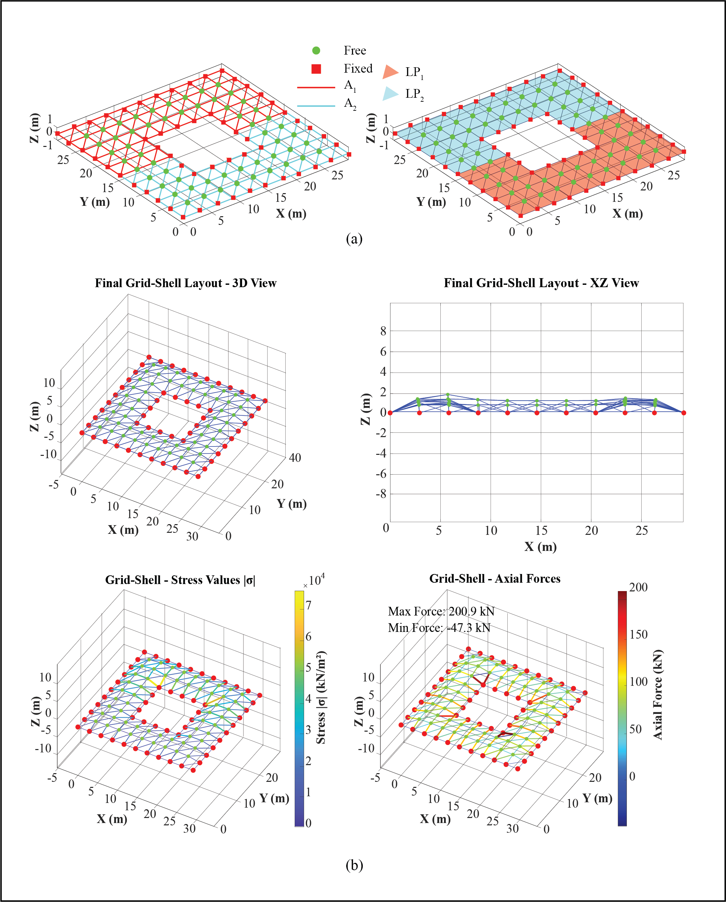
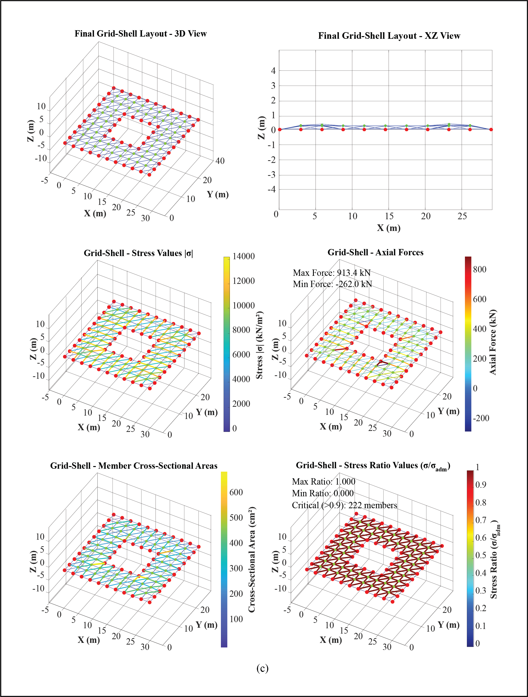

# Grid-Shell Form-Finding & Analysis Suite — A MATLAB GUI Tool

MATLAB GUI toolkit for timber grid shell design using the Potential Energy Method. Includes Form Finding Tool (FFT) and Coupled Analysis Tool (CAT) with Member Sizing. Features a three-panel interface with interactive controls, data tables, and real-time 3D visualisation.

---

## Overview

A comprehensive MATLAB-based graphical toolkit for the structural analysis and design of timber grid shell structures using the Potential Energy Method (PEM). This repository provides two standalone GUI applications that streamline the complete workflow from geometric definition through form finding and coupled structural analysis, addressing key limitations in existing PEM implementations.

### Form Finding Tool (FFT)

The FFT performs form finding by minimising total potential energy to determine equilibrium shell geometries. Unlike conventional implementations that assume uniform material properties across all members, this tool enables individual assignment of Young's modulus (E) and cross-sectional area (A) to each member independently. Users define a planar grid, select nodes with boundary constraints, assign heterogeneous material properties and member-specific cross-sectional areas, and apply distinct load patterns to individual panels. The tool produces a structurally efficient curved geometry from an initially flat configuration, supporting arbitrary grid shell topologies rather than being restricted to specific configurations.

### Coupled Analysis Tool (CAT)

The CAT extends the workflow to address the fundamental problem of uncoupled stiffness and geometry in statically indeterminate structures. When members are resized during design verification, their axial stiffness (EA/L) changes, redistributing internal forces and invalidating the original equilibrium geometry. The CAT implements an iterative coupled form-finding and member-sizing procedure that dynamically updates member stiffness properties during the process, alternating between geometry optimisation and code-compliant member sizing until convergence is achieved, delivering structurally valid designs where geometry and member capacities are mutually consistent.

### Key Features

- Three-panel GUI: interactive controls, editable data tables, and real-time 3D visualisation
- Per-member material property and cross-sectional area assignment
- Automated panel detection with individual load pattern assignment
- Full CSV import/export for interoperability with external solvers

---

## Getting Started

### Prerequisites

- **MATLAB** (R2020a or later recommended)
- **Optimization Toolbox** — the computational backend uses `fminunc` for potential energy minimisation

### Directory Structure

All scripts and helper functions must reside in the same parent directory:

```
/GridShell_Analysis/
├── GridShellAnalysisTool.m                      % CAT GUI
├── GridShellAnalysisTool_FormFindingOnly.m      % FFT GUI
├── RunGridShellAnalysis.m                       % CAT backend
├── RunGridShellFormFinding.m                    % FFT backend
├── gridshell_panels.m
├── gridshell_panels_loads.m
└── /FFMS/                                       % Helper functions
    ├── GetL.m
    ├── GetNepsZdof.m
    └── GetPotential.m
```

### Launching the Tools

Open MATLAB and set the current folder to `GridShell_Analysis`. Then run either command in the Command Window:

| Tool | Command |
|------|---------|
| Form Finding Tool (FFT) | `GridShellAnalysisTool_FormFindingOnly` |
| Coupled Analysis Tool (CAT) | `GridShellAnalysisTool` |

The GUI window will open with three panels: controls on the left, data tables in the centre, and 3D visualisation on the right. Follow the numbered sections in the controls panel from top to bottom to define your grid shell and run the analysis.

---

## Workflow

1. **Generate Grid** — Define X/Y spacing and spans to create a rectangular grid of candidate points
2. **Select Nodes** — Pick nodes from the grid as free or fixed (boundary) nodes
3. **Connect Edges** — Draw edges manually or use auto-connect (orthogonal or diagonal)
4. **Define Materials** — Assign material properties (E, fcok, ftok, kmod) with custom colours
5. **Set Member Areas** *(FFT)* — Assign cross-sectional areas to individual members
6. **Define Loads** — Create load patterns (dead + wind) with custom colours and assign to panels
7. **Generate Panels** — Auto-detect quadrilateral panels from the edge connectivity
8. **Validate & Run** — Check inputs, generate CSV files, and launch the analysis

---

## Output

Both tools generate a timestamped output folder containing:

- CSV files for all structural data (nodes, edges, materials, loads, panels, parameters)
- PNG images of the grid structure (3D and plan views)
- Analysis result figures saved automatically after completion

---


## Form Finding Tool (FFT)


## Coupled Analysis Tool (CAT)


## Design Examples
### (a) Initial flat grid-shell layout with load pattern and cross-sectional area assignments, (b) resultant plots from the form-finding analysis, (c) resultant plots from the coupled analysis.



## References
Y. Jiang, T. Zegard, W. F. Baker, and G. H. Paulino, “Form-finding of grid-shells using the ground structure and potential energy methods: a comparative study and assessment,” Structural and Multidisciplinary Optimization, vol. 57, no. 3, pp. 1187–1211, Mar. 2018, doi: 10.1007/s00158-017-1804-3.

S. Adriaenssens, L. NEY, E. BODARWE, and C. Williams, “Dutch Maritime Museum: Form-finding of an irregular faceted skeletal shell - Part b,” Jan. 2010.

S. Adriaenssens, P. Block, D. Veenendaal, and C. Williams, Eds., Shell Structures for Architecture: Form Finding and Optimization. London: Routledge, 2014. doi: 10.4324/9781315849270.

Y. Jiang, “Free form finding of grid shell structures,” text, University of Illinois at Urbana-Champaign, 2015. Accessed: Sep. 17, 2025. [Online]. Available: https://hdl.handle.net/2142/89080


